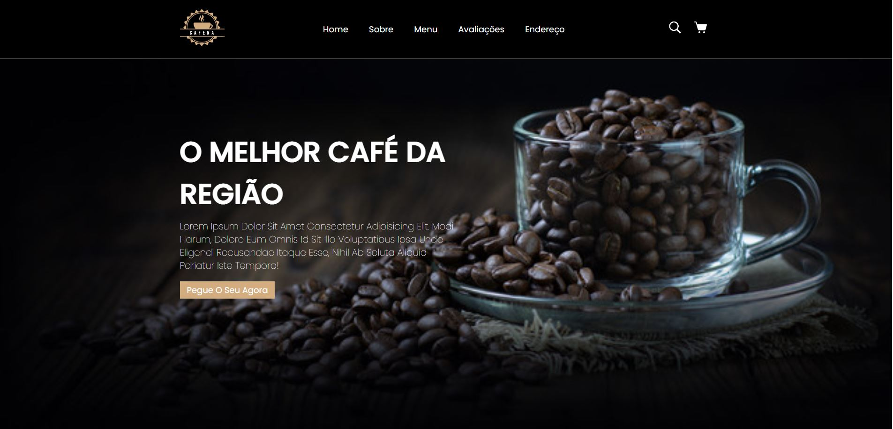

<h1 align="center"> Cafeteria Expresso </h1>

Projeto proprio criado com a finalidade de treinar o conhecimento em CSS, HTML, Git/Github.
 

  <a href="#-aprendizado">Aprendizado</a>&nbsp;&nbsp;&nbsp;|&nbsp;&nbsp;&nbsp;
  <a href="#-tecnologias">Tecnologias</a>&nbsp;&nbsp;&nbsp;|&nbsp;&nbsp;&nbsp;
  <a href="#-projeto">Projeto</a>&nbsp;&nbsp;&nbsp;|&nbsp;&nbsp;&nbsp;
  <a href="#-layout">Layout</a>&nbsp;&nbsp;&nbsp;|&nbsp;&nbsp;&nbsp;
  <a href="#memo-licença">Licença</a>

 

  

  

  

  

  

## 👨‍💻 Aprendizado

Com esse projeto foi possível revisar o conhecimento nas tecnologias HTML, CSS e Git/Github. Foi criado um header fixo para que ao descer na pagina, consiga ser acessa dos menus do header mais rapidamente, também foi criado uma ancoragem no menu, onde ao clicar nos links a pagina vai diretamente para o respectivo topico clicado.

## 🚀 Tecnologias

Esse projeto foi desenvolvido com as seguintes tecnologias:

- HTML e CSS
- Git e Github

## 💻 Projeto

O projeto da cafeteria expresso foi feito para um trabalho freelancer e criação de uma pagina que pode ser vendida para cafeterias da região.

- [Acesse o projeto finalizado, online](https://netinhosm1.github.io/cafeteria-expresso/)

## 🔖 Layout

Você pode visualizar o layout do projeto através [DESSE LINK](https://netinhosm1.github.io/cafeteria-expresso/).

## :memo: Licença

Esse projeto está sob a licença MIT.

---

Feito por netinhosm
